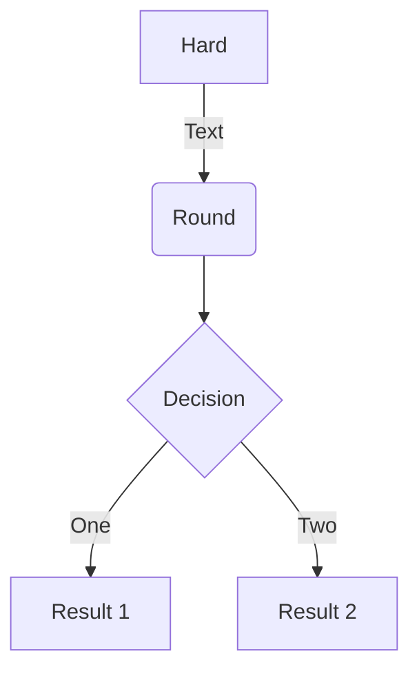
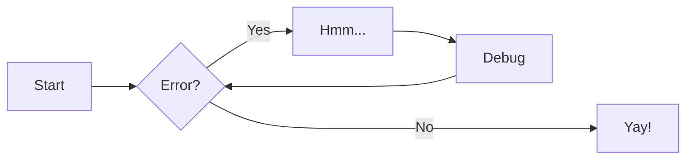

---
hide:
  - toc
---

# :simple-markdown: MkDocs <!-- omit in toc -->

```bash
python -m venv venv
source venv/bin/activate
pip --version

pip install mkdocs-material

mkdocs new .
mkdocs serve
```

## Plugins

```bash
pip install mkdocs-minify-plugin
pip install mkdocs-glightbox
```

## Emojis

- [Icons, Emojis](https://squidfunk.github.io/mkdocs-material/reference/icons-emojis)

:simple-materialformkdocs:

## References

- [Create Code Documentation With MkDocs Material Theme](https://youtu.be/Q-YA_dA8C20?si=KYEpTzvnlfUye1xC)
- [squidfunk/mkdocs-material](https://github.com/squidfunk/mkdocs-material/blob/master/mkdocs.yml)

## Examples

### Admonitions

!!! warning
    All good, no worries.

??? info "Phasellus posuere in sem ut cursus"

    Lorem ipsum dolor sit amet, consectetur adipiscing elit. Nulla et euismod
    nulla. Curabitur feugiat, tortor non consequat finibus, justo purus auctor
    massa, nec semper lorem quam in massa.

### Annotations

Lorem ipsum dolor sit amet, (1) consectetur adipiscing elit.
{ .annotate }

1. :man_raising_hand: I'm an annotation! I can contain `code`, __formatted
    text__, images, ... basically anything that can be expressed in Markdown.

### Buttons

[Subscribe to our newsletter](#buttons){ .md-button .md-button--primary }
[Send :fontawesome-solid-paper-plane:](#buttons){ .md-button }

### Code blocks

``` { .yaml .annotate }
# Code block content
```

``` py linenums="1"
def bubble_sort(items):
    for i in range(len(items)):
        for j in range(len(items) - 1 - i):
            if items[j] > items[j + 1]:
                items[j], items[j + 1] = items[j + 1], items[j]
```

#### Customization

- Additional CSS in `docs/stylesheets/extra.css` to tweak a specific type of string.
- Additional JavaScript in `docs/javascripts/tablesort.js` to make data tables sortable.
- [Pygments styles](https://pygments.org/styles/)
- [Pygments languages](https://pygments.org/languages/)

### Content tabs

=== "Bash"

    ```bash
    echo "Hello bash 1!"
    ```

=== "PowerShell"

    ```powershell
    Write-Host "Hello PowerShell 1!"
    ```

===! "Bash"

    ```bash
    echo "Hello bash 2!"
    ```

=== "PowerShell"

    ```powershell
    Write-Host "Hello PowerShell 2!"
    ```

### Data tables

| Method      | Description                          |
| ----------- | ------------------------------------ |
| `GET`       | :material-check:     Fetch resource  |
| `PUT`       | :material-check-all: Update resource |
| `DELETE`    | :material-close:     Delete resource |

### Diagrams

Example-1:



Example-2:



### Grids

<div class="grid cards" markdown>

- :fontawesome-brands-html5: __HTML__ for content and structure
- :fontawesome-brands-js: __JavaScript__ for interactivity
- :fontawesome-brands-css3: __CSS__ for text running out of boxes
- :fontawesome-brands-internet-explorer: __Internet Explorer__ ... huh?

</div>

### Icons and Emojis

- [Material for MkDocs / References / Icons, Emojis](https://squidfunk.github.io/mkdocs-material/reference/icons-emojis/)

### Images

<figure markdown>

<figcaption markdown>Blue clouds under white sky photo. Credit: [CHUTTERSNAP](https://unsplash.com/photos/blue-clouds-under-white-sky-9AqIdzEc9pY)</figcaption>
</figure>

<figure markdown>
  { width="300" }
  <figcaption>Cumulus clouds under blue sky photo. Credit: [Anton Darius](https://unsplash.com/photos/cumulus-clouds-under-blue-sky-15AMBS1gM2E)</figcaption>
</figure>

### Lists

- [X] item 1
  - [ ] item B
        more text
    - [x] item a
    - [ ] item b
- [ ] item 2

### Tooltips

:material-information-outline:{ title="Important information" }
